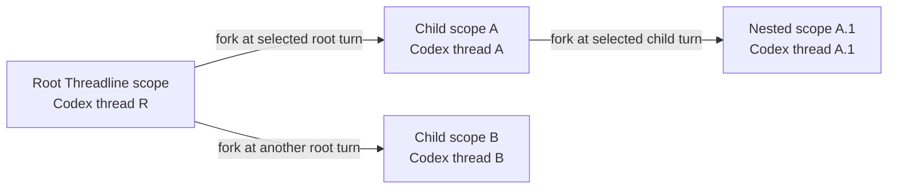

# Threadline

Threadline is a terminal UI for branching from an exact passage in an LLM CLI answer without losing the conversation that produced it. A deep dive stays visible beside its source, can contain its own tool calls, and can branch again.

Codex is the first supported provider. Threadline uses real Codex provider threads for model context and a local scope tree for navigation, persistence, and rendering.

## What it looks like


The full-screen view keeps the root transcript, two inline deep dives, one nested deep dive, and collapsed tool activity in one workspace. The header shows the provider, current scope breadcrumb, and thread capacity; the footer shows the active interaction mode and available keys.


In the detail view:

- each question remains in the transcript that produced it;
- `1 thread  1 reply` is a collapsible group attached to the selected answer passage;
- stable accent colors and vertical rails preserve parent/child identity through nesting and resize;
- child answers are selectable, so a deep dive can create another deep dive;
- consecutive tool calls collapse into an `activities` summary until their details are needed.

The screenshots come from `threadline demo`, an offline showcase with Chinese sample content. No Codex connection is required for the demo.

## Provider and CLI compatibility

| Backend | Status | Integration | Notes |
| --- | --- | --- | --- |
| OpenAI Codex CLI | Supported | Codex app-server over stdio | Start, resume, fork, stream, interrupt, approvals, tool events, model settings, slash commands, and provider context compaction. |
| Offline demo | Supported | Built-in deterministic provider | Exercises the TUI, nested threads, tools, command panels, and model picker without a network connection. |
| Anthropic Claude Code | Not currently supported | No Claude provider exists yet | Claude Code is not installed or invoked by Threadline. Support would require a provider adapter with equivalent thread fork/resume and structured event semantics. |

The UI and controller are provider-oriented, but the only production adapter in this repository today is `src/providers/codex.mjs`. “LLM CLI” describes the intended category, not a claim that every CLI is already supported.

## Requirements

- Node.js 18 or newer
- a working Codex login (`codex login`) for live conversations
- a terminal; Windows Terminal is recommended on Windows

## Install

Install the current `main` branch. The package includes a compatible `@openai/codex` dependency:

```bash
npm install --global https://github.com/yinshanlake/threadline/archive/refs/heads/main.tar.gz
codex login
threadline --probe
threadline demo
threadline --new
```

Try the demo without a global install:

```bash
npx --yes --package=https://github.com/yinshanlake/threadline/archive/refs/heads/main.tar.gz threadline demo
```

Or work from a clone:

```bash
git clone https://github.com/yinshanlake/threadline.git
cd threadline
npm install
npm test
npm link
threadline demo
```

`threadline --probe` verifies the Codex app-server handshake without starting a conversation. `threadline demo` always starts a fresh offline showcase; `--demo` uses the resumable demo session.

## How the UI manages threads

1. With an empty composer, press `Up` or `Tab` to inspect the latest completed answer.
2. Move between answer passages with `Up`/`Down`; press `V` to switch between block and sentence precision.
3. Start typing on the selected passage, or press `Enter`, then ask the focused follow-up.
4. Threadline anchors the new scope to the original assistant message and raw source range, then asks the provider to fork at the turn that produced that answer.
5. The reply is rendered inline. Open it as a focused scope with `Enter`, return with `B`, or press `T` for the complete thread tree.

Anchors persist message IDs, provider turn IDs, raw source offsets, the exact quote, and nearby prefix/suffix text. They never persist screen rows or columns, so CJK width, emoji, terminal resize, or wrapping can change the layout without changing what a thread refers to.

Thread controls:

| Key | Action |
| --- | --- |
| `Up` / `Down` | Move through passages, thread groups, and tool activities. |
| `Enter` | Start a focused follow-up, open a thread, or expand the selected activity. |
| `Left` / `Right` | Collapse or expand a thread, activity group, or activity. |
| `Space` | Toggle the selected collapsible item. |
| `V` | Toggle block/sentence selection precision. |
| `T` | Open the complete thread overview. |
| `B` | Return from a focused thread to its parent. |
| `Esc` | Return to input, decline a prompt, or interrupt the active Codex turn. |
| `Ctrl+C` | Save the session and exit. |

By default a session allows 32 deep-dive threads, 4 nested levels, and 3 threads on the same excerpt. These limits are checked before the provider is forked, preventing orphan provider threads. An identical follow-up on the same excerpt opens the existing thread rather than creating another fork. The header shows `current/max` capacity and adds `!` after 75%.

```bash
threadline --max-threads 16 --max-depth 3 --max-per-anchor 2
```

## How context is managed

Threadline separates UI state from model context:

| Owner | What it stores or controls |
| --- | --- |
| Threadline scope | Parent scope, anchor, local turns, collapse state, accent, navigation, and provider thread/turn IDs. |
| Codex provider thread | Canonical model conversation history, context window, compaction, and future turns for that branch. |

Creating a deep dive calls Codex `thread/fork` with the current scope's provider thread ID and the selected answer's `lastTurnId`. Codex copies the canonical conversation up to that turn. Threadline then sends a focused first turn containing the exact selected excerpt and the new question.



After a fork, future histories are isolated: new root messages do not silently enter existing children, and child turns do not alter the root. A nested deep dive forks from its immediate parent provider thread, not from the root. Each scope can therefore evolve independently while the local tree keeps their relationship navigable.

`/compact` asks Codex to compact only the active provider thread. Inspect highlights, screen rows, and collapsed UI state are never reconstructed as model history.

## Tool activity and approvals

Threadline preserves assistant messages and tool activities in the order received from Codex. It recognizes structured activity for:

- command execution and terminal interaction;
- file changes and patch updates;
- MCP and dynamic tool calls;
- web search;
- plans and reasoning summaries;
- collaboration/sub-agent activity;
- image generation;
- context compaction, review-mode transitions, and waits.

Consecutive activities collapse into one summary row. Expand the group to inspect each call, then expand an individual activity to view its command, working directory, arguments, changes, progress, streamed output, result, exit code, duration, and received character count when available. Large payloads are split into 8,192-character pages navigated with `[` and `]`. Threadline keeps the complete payload it received; it cannot recover content already truncated by Codex or an upstream tool.

Command, file-change, and permission requests are presented explicitly. Press `y` to accept and `n` or `Esc` to decline. Structured `requestUserInput` questions are handled separately from approvals, and concurrent requests are queued. Unknown request types are rejected rather than guessed.

`--yolo` requests Codex's `danger-full-access` sandbox with `approval_policy=never`. It is deliberately opt-in.

## Full-screen, line, and demo modes

Threadline uses the full-screen TUI when the terminal supports it. It automatically falls back to portable line mode for `TERM=dumb` or non-TTY input/output.

```bash
threadline demo                 # fresh offline full-screen showcase
threadline demo --snapshot      # non-interactive text snapshot
threadline demo --no-alt-screen # preserve terminal scrollback
threadline --line               # force portable line mode
threadline --new                # start a fresh live Codex session
threadline --cwd PATH           # set the workspace passed to Codex
threadline --no-color           # disable ANSI color
```

Line mode exposes `/segments`, `/dive N question`, `/activities`, `/activity N`, `/threads`, `/open N`, `/back`, and `/quit`. Run `/help` in that mode for the current list.

## Slash commands

Typing `/` in the full-screen composer opens a filtered local command menu. Threadline dispatches supported commands through its controller or the Codex app-server; slash text is not silently turned into a model prompt.

| Area | Commands |
| --- | --- |
| Threadline | `/help`, `/status`, `/threads`, `/back`, `/copy`, `/new`, `/quit`, `/exit` |
| Model and mode | `/model [MODEL [EFFORT]]`, `/personality`, `/plan [PROMPT]`, `/default [PROMPT]`, `/compact` |
| Permissions and account | `/permissions [PROFILE]`, `/usage` |
| Development workflow | `/review [INSTRUCTIONS]`, `/init`, `/diff`, `/rename NAME` |
| Extensions | `/mcp [verbose]`, `/skills [FILTER]` |

Commands such as `/theme`, `/keymap`, `/vim`, and `/app` control the original Codex TUI and have no portable app-server equivalent. Threadline reports them as Codex-TUI-only and does not forward them to the model.

## Sessions and storage

Threadline automatically resumes the latest session for a working directory and archives every session under a GUID. On exit it prints a portable resume command:

```text
Session saved: 91e041bc-6238-47cd-9f37-4146e4432dc2
To continue, run: threadline resume 91e041bc-6238-47cd-9f37-4146e4432dc2
```

Use `threadline resume GUID` or `threadline --resume GUID` from any directory. `--session FILE` selects an explicit local session file.

Threadline stores anchors, transcripts, branch layout, tool activity, and UI state under `%LOCALAPPDATA%\threadline\sessions` on Windows or the platform state directory on macOS/Linux. Codex stores its provider sessions normally. Local sessions and transcripts are not part of this repository.

Long streams may be coalesced for terminal repaint, but persisted events are not discarded. Model text is sanitized before rendering so it cannot emit terminal control sequences. Malformed app-server JSON is surfaced as a protocol error rather than interpreted as conversation data. Sessions from the earlier `0.1` prototype remain readable; legacy event order is labeled when it cannot be known exactly.

## Codex integration notes

The Codex app-server protocol is experimental. Its JSON-RPC details are isolated in `src/providers/codex.mjs`; run `threadline --probe` after Codex upgrades. Threadline prefers its installed `@openai/codex` dependency. Set `THREADLINE_CODEX_PATH` to an absolute `codex` executable or `codex.js` path for a nonstandard installation.

The legacy `ado` MCP entry is disabled only inside Threadline's Codex process because it duplicates the newer `azure-devops` entry and can delay the first answer. This does not modify global Codex configuration; other configured MCP servers remain available.

## Development

```bash
npm install
npm test
npm run snapshot
npm run probe
```

CI runs tests and package dry-runs on Node.js 18 and 22 across Linux, Windows, and macOS. See [SECURITY.md](SECURITY.md) before reporting a vulnerability or sharing diagnostics.
